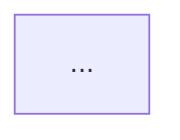

# Plan Mode

Enter plan mode to design HOW to implement what was defined in the spec phase.

## Skill Reference

Read the agent-session skill for templates and full documentation:
- Skill: `.claude/skills/agent-session/SKILL.md`
- Templates: `.claude/skills/agent-session/templates/`
- Working directory: `agents/sessions/`

## Variables

```
PLAN_ARGUMENTS = $ARGUMENTS
SESSIONS_DIR = agents/sessions
TEMPLATES_DIR = .claude/skills/agent-session/templates
```

## Instructions

Parse PLAN_ARGUMENTS to determine the action:

1. **No arguments**: Use active session with finalized spec
2. **`[session-id]`**: Use specified session
3. **`continue`**: Continue existing plan work
4. **`finalize`**: Finalize the plan (marks it ready for build)

**IMPORTANT**: Validate that the spec is finalized before proceeding.

## Core Principles

Plan mode:
- **Reads the finalized spec** as the foundation
- **Makes architectural decisions** - Technical approach, patterns
- **Creates implementation steps** - Ordered, with files identified
- **Defines testing strategy** - How to verify the implementation

<workflow>
    <phase id="1" name="Load Session">
        <action>Load active session or specified session</action>
        <action>Verify spec.status === "finalized"</action>
        <action>If not finalized, prompt user to finalize spec first</action>
        <action>Read spec.md thoroughly</action>
    </phase>

    <phase id="2" name="Initialize Plan Phase">
        <action>Update state.json:
            - current_phase: "plan"
            - phases.plan.status: "draft"
            - phases.plan.started_at: now()
        </action>
        <action>Create initial plan.md from template</action>
    </phase>

    <phase id="3" name="Codebase Analysis">
        <action>Analyze existing codebase for:
            - Relevant existing patterns
            - Files that will need modification
            - Integration points
            - Testing patterns in use
        </action>
        <action>Summarize findings in plan.md</action>
    </phase>

    <phase id="4" name="Architecture Design">
        <action>Design technical approach based on:
            - Spec requirements
            - Existing codebase patterns
            - Technical constraints
        </action>
        <action>Document key architectural decisions</action>
        <action>Create diagrams showing component relationships</action>
    </phase>

    <phase id="5" name="Implementation Steps">
        <action>Break down implementation into ordered steps</action>
        <action>For each step, define:
            - Files to create/modify
            - Key changes to make
            - Dependencies on other steps
            - Validation criteria
        </action>
    </phase>

    <phase id="6" name="Testing Strategy">
        <action>Define testing approach:
            - Unit tests needed
            - Integration tests
            - Manual verification steps
        </action>
    </phase>

    <phase id="7" name="Finalization">
        <trigger>`finalize` command</trigger>
        <action>Review plan for completeness</action>
        <action>Update state.json:
            - phases.plan.status: "finalized"
            - phases.plan.finalized_at: now()
        </action>
        <action>Add finalization header to plan.md</action>
        <action>Report: "Plan finalized. Ready for build phase."</action>
    </phase>
</workflow>

<plan_template>
# Implementation Plan: {{TOPIC}}

> **Session**: `{{SESSION_ID}}`
> **Status**: Draft
> **Spec**: [spec.md](./spec.md)
> **Created**: {{DATE}}

## Summary

*Brief summary of what we're implementing based on the spec*

## Spec Reference

### Goals Being Addressed
*Pull from spec.md*

### Success Criteria
*Pull from spec.md*

## Codebase Analysis

### Relevant Existing Patterns
*What patterns exist that we should follow?*

### Files to Modify
| File | Purpose | Changes |
|------|---------|---------|

### Files to Create
| File | Purpose |
|------|---------|

### Integration Points
*Where does this connect to existing systems?*

## Architecture

### Approach
*High-level technical approach*

### Component Diagram


### Key Decisions
| Decision | Rationale | Alternatives Considered |
|----------|-----------|------------------------|

## Implementation Steps

### Phase 1: [Name]
**Goal**: *What this phase accomplishes*

1. [ ] Step description
   - Files: `path/to/file.ts`
   - Changes: What to change
   - Validation: How to verify

2. [ ] Step description
   ...

### Phase 2: [Name]
...

## Testing Strategy

### Unit Tests
- [ ] Test description

### Integration Tests
- [ ] Test description

### Manual Verification
- [ ] Verification step

## Risks & Mitigations

| Risk | Impact | Mitigation |
|------|--------|------------|

## Estimated Scope

*Rough indication of scope - not time estimates*

---
*This plan is based on the finalized spec and will guide implementation.*
</plan_template>

<user_output>
When starting plan phase:
```
## Plan Phase Started

**Session ID**: `{session_id}`
**Topic**: {topic}
**Spec Status**: Finalized

### Spec Summary
{Brief summary from spec.md}

I'll now analyze the codebase and design an implementation approach.
{Begin codebase analysis}
```

When continuing:
```
## Resuming Plan Session

**Session ID**: `{session_id}`
**Topic**: {topic}
**Plan Status**: {plan_status}

### Current Progress
{Summary of plan.md so far}

{Continue where left off}
```

When finalizing:
```
## Plan Finalized

**Session ID**: `{session_id}`
**Topic**: {topic}

### Implementation Overview
{Summary of approach}

### Key Files
{List of files to create/modify}

### Ready for Build
The plan is now ready for implementation. The implementation steps
provide a roadmap for building this feature.

**Plan Location**: `agents/sessions/{session_id}/plan.md`
```
</user_output>

<validation>
Before proceeding with planning, validate:
1. Active session exists OR session-id provided
2. Session has a spec.md file
3. Spec status is "finalized"

If validation fails:
- Missing session: "No active session. Use `/spec [topic]` to start."
- Spec not finalized: "Spec is not finalized. Use `/spec finalize` first."
</validation>
