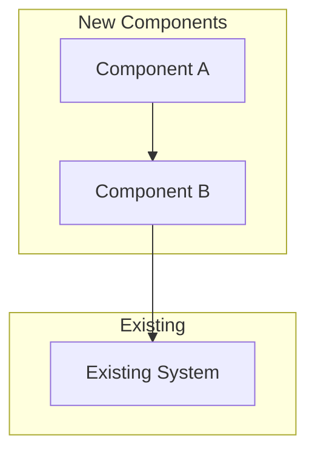

# Implementation Plan: {{TOPIC}}

> **Session**: `{{SESSION_ID}}`
> **Status**: Draft
> **Spec**: [spec.md](./spec.md)
> **Created**: {{DATE}}

## Summary

*Brief summary of what we're implementing based on the spec*

## Spec Reference

### Goals Being Addressed

*Pulled from spec.md*

### Success Criteria

*Pulled from spec.md*

## Codebase Analysis

### Relevant Existing Patterns

*What patterns exist that we should follow?*

### Files to Modify

| File | Purpose | Changes Needed |
|------|---------|----------------|
|      |         |                |

### Files to Create

| File | Purpose |
|------|---------|
|      |         |

### Integration Points

*Where does this connect to existing systems?*

## Architecture

### Approach

*High-level technical approach*

### Component Diagram

### Key Decisions

| Decision | Rationale | Alternatives Considered |
|----------|-----------|------------------------|
|          |           |                        |

## Implementation Steps

### Phase 1: {{PHASE_NAME}}

**Goal**: *What this phase accomplishes*

1. [ ] Step description
   - **Files**: `path/to/file.ts`
   - **Changes**: What to change
   - **Validation**: How to verify

2. [ ] Step description
   - **Files**:
   - **Changes**:
   - **Validation**:

### Phase 2: {{PHASE_NAME}}

**Goal**: *What this phase accomplishes*

1. [ ] Step description

## Testing Strategy

### Unit Tests

- [ ] Test description

### Integration Tests

- [ ] Test description

### Manual Verification

- [ ] Verification step

## Risks & Mitigations

| Risk | Impact | Mitigation |
|------|--------|------------|
|      |        |            |

## Dependencies

*External dependencies, blocking items, or prerequisites*

---
*This plan is based on the finalized spec and will guide implementation.*
