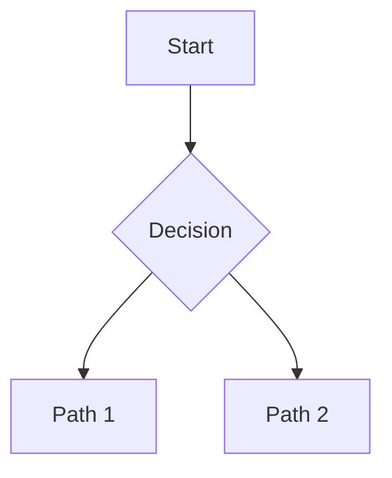

# {{TOPIC}}

> **Session**: `{{SESSION_ID}}`
> **Status**: Draft
> **Created**: {{DATE}}

## Overview

{{INITIAL_UNDERSTANDING}}

## Problem Statement

*What problem are we solving? Why does it matter?*

## Goals

### High-Level Goals

*The north star - what does ultimate success look like? Include WHY this matters.*

### Mid-Level Goals

*Major capabilities or milestones needed to achieve high-level goals. Capture the reasoning behind each.*

### Detailed Goals

*Specific behaviors or features - added as conversation progresses. Note user's preferences and "taste".*

## Non-Goals

*What we are explicitly NOT building - prevents scope creep*

-

## Success Criteria

*How do we know we're done? Testable outcomes*

- [ ]

## Context & Background

*Relevant existing systems, prior art, stakeholder input. Include user's mental model and design philosophy when relevant.*

## Key Decisions

*Capture the WHY behind decisions, not just the WHAT. Include user's reasoning and preferences.*

<!-- Add decisions as they are made using this format:

### [Decision Title]
**Rationale**: [Why this decision was made]
**Made**: [YYYY-MM-DD]

-->

## Open Questions

- [ ] *Questions still needing answers*

## Diagrams

*Mermaid or ASCII diagrams as understanding develops*

## Notes

*Working notes, ideas, considerations*

---
*This spec is a living document until finalized.*
