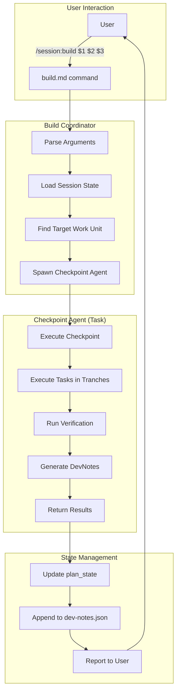

# Implementation Plan: Build Mode for session

> **Session**: `2025-12-28_build-mode_f8k2n5`
> **Status**: ✅ Finalized
> **Spec**: [spec.md](./spec.md)
> **Created**: 2025-12-28
> **Finalized**: 2025-12-28

---
**PLAN FINALIZED** - Ready for build phase.

---

## Summary

Implementing build mode - the third and final phase of the session skill's spec → plan → build workflow. Build mode executes finalized plans checkpoint by checkpoint, spawning dedicated agents per checkpoint with clean context, tracking progress for resume capability, and capturing implementation learnings in DevNotes.

## Spec Reference

### Goals Being Addressed
- Execute finalized plans reliably with clear progress tracking
- Enable pause/resume at any point without losing context
- Capture learnings and deviations as implementation unfolds

### Key Decisions from Spec
| Decision | Implication |
|----------|-------------|
| User-in-loop after each checkpoint | Report results, wait for user before continuing |
| Spawn new agent task per checkpoint | Use Task tool with checkpoint-specific prompt |
| DevNotes as separate JSON file | Create `dev-notes.json` with structured notes |
| Partial completion on errors | Track exact position in plan_state |
| Verification required with override | Run verification_steps, allow user skip |
| Positional args: session, checkpoint, tranche | Parse $1, $2, $3 in command |

## Codebase Analysis

### Relevant Existing Patterns

**Command Pattern** (from spec.md, plan.md):
- Frontmatter with description, argument-hint, allowed-tools, model
- Variables section defining positional args
- Workflow phases with actions
- User output templates for different scenarios
- Validation and error handling sections

**State Management**:
- `state.json` tracks current_phase and phases.*.status
- `plan_state` object for build progress (already defined in template)

**Directory Structure**:
```
.claude/
├── commands/session/
│   ├── spec.md    ✓ exists
│   ├── plan.md    ✓ exists
│   └── build.md   ← NEW
└── skills/session/
    ├── SKILL.md
    ├── spec/
    ├── plan/
    └── build/
        ├── OVERVIEW.md    ✓ exists (needs update)
        └── templates/
            └── dev-notes.json   ← NEW
```

### Files to Create
| File | Purpose |
|------|---------|
| `.claude/commands/session/build.md` | Build mode command with workflows |
| `.claude/skills/session/build/templates/dev-notes.json` | DevNotes template |

### Files to Modify
| File | Purpose | Changes |
|------|---------|---------|
| `.claude/skills/session/build/OVERVIEW.md` | Build phase docs | Add DevNotes, update command syntax |
| `.claude/skills/session/SKILL.md` | Main skill docs | Minor updates if needed |

### Integration Points
- Reads `plan.json` for checkpoint/tranche/task structure
- Updates `state.json.plan_state` for progress tracking
- Creates/updates `dev-notes.json` for implementation notes
- Uses Task tool to spawn checkpoint agents

## Architecture

### Approach

Build mode operates as a **coordinator** that:
1. Parses arguments to determine target (auto-discover or explicit)
2. Loads plan.json and finds the work unit to execute
3. Spawns a checkpoint agent via Task tool with curated context
4. Receives results and updates state
5. Reports to user and waits for confirmation

### Component Diagram


### Key Decisions
| Decision | Rationale | Alternatives Considered |
|----------|-----------|------------------------|
| Task tool for checkpoint agents | Clean context, parallel execution potential | Inline execution (context bloat) |
| JSON for DevNotes | Machine-parseable, consistent with plan.json | Markdown (harder to parse) |
| Coordinator pattern | Keeps main command simple, delegates complexity | Monolithic execution |

## Implementation Checkpoints

### Checkpoint 1: Create build.md Command
**Goal**: Establish the build command with full workflow definition

**Files**:
- CREATE: `.claude/commands/session/build.md`

**Tranches**:

**1.1: Command Structure**
- [ ] Create frontmatter (description, argument-hint, allowed-tools, model)
- [ ] Define variables ($1=session-id, $2=checkpoint, $3=tranche)
- [ ] Add skill reference section

**1.2: Workflow Phases**
- [ ] Phase 1: Parse inputs and validate session
- [ ] Phase 2: Load plan.json and determine target
- [ ] Phase 3: Spawn checkpoint agent with context
- [ ] Phase 4: Handle results and update state
- [ ] Phase 5: Report to user

**1.3: Agent Prompt Template**
- [ ] Define what context checkpoint agent receives
- [ ] Include spec goals, checkpoint details, prior DevNotes
- [ ] Define expected outputs from agent

**1.4: User Output Templates**
- [ ] Starting build scenario
- [ ] Checkpoint complete scenario
- [ ] Error/pause scenario
- [ ] Build complete scenario

**1.5: Error Handling**
- [ ] Missing session ID
- [ ] Session not found
- [ ] Plan not finalized
- [ ] Invalid checkpoint/tranche target

**Verification**:
- [ ] Command appears in `/help` with correct description
- [ ] Argument hint shows correctly
- [ ] Basic invocation parses arguments correctly

---

### Checkpoint 2: Create DevNotes Template
**Goal**: Establish the dev-notes.json structure

**Files**:
- CREATE: `.claude/skills/session/build/templates/dev-notes.json`

**Tranches**:

**2.1: Template Structure**
- [ ] Define JSON schema with notes array
- [ ] Include id, timestamp, scope, category, content fields
- [ ] Add example entries for reference

**Verification**:
- [ ] Template is valid JSON
- [ ] Schema covers all note types (deviation, discovery, decision, blocker, resolution)

---

### Checkpoint 3: Update Build OVERVIEW.md
**Goal**: Align documentation with spec decisions

**Files**:
- MODIFY: `.claude/skills/session/build/OVERVIEW.md`

**Tranches**:

**3.1: Add DevNotes Section**
- [ ] Document DevNotes purpose and structure
- [ ] Show example of adding a DevNote
- [ ] Explain categories

**3.2: Update Command Syntax**
- [ ] Change to positional arguments format
- [ ] Add examples for checkpoint/tranche targeting

**3.3: Update Workflow Description**
- [ ] Add checkpoint agent spawning step
- [ ] Include verification with override flow
- [ ] Document partial completion behavior

**Verification**:
- [ ] Documentation matches spec decisions
- [ ] Examples are accurate and helpful

---

### Checkpoint 4: Integration Testing
**Goal**: Verify the complete flow works

**Tranches**:

**4.1: Manual Verification**
- [ ] Create a test session with finalized spec and plan
- [ ] Run `/session:build [test-session]`
- [ ] Verify checkpoint agent spawns correctly
- [ ] Verify state updates after completion
- [ ] Verify DevNotes are created

**Verification**:
- [ ] Full workflow executes without errors
- [ ] State tracking works across pause/resume
- [ ] DevNotes capture expected information

## Testing Strategy

### Manual Verification
- [ ] `/session:build` without args shows helpful error
- [ ] `/session:build invalid-id` reports session not found
- [ ] `/session:build [valid-id]` with unfinalized plan shows error
- [ ] `/session:build [valid-id]` starts checkpoint execution
- [ ] `/session:build [valid-id] 2` targets specific checkpoint
- [ ] `/session:build [valid-id] 2 2.1` targets specific tranche
- [ ] Verification failure allows user override
- [ ] Error during execution creates partial completion state
- [ ] Resume picks up from exact position

### Integration Checks
- [ ] plan_state updates correctly after each task
- [ ] dev-notes.json accumulates notes properly
- [ ] Checkpoint agents receive correct context

## Risks & Mitigations

| Risk | Impact | Mitigation |
|------|--------|------------|
| Context overflow in checkpoint agent | Agent fails or performs poorly | Curate context carefully; include only relevant checkpoint data |
| State corruption on error | Unable to resume | Update state atomically; validate before write |
| Verification step failures block progress | User stuck | Override mechanism with DevNote documentation |

## Estimated Scope

- **Checkpoint 1** (build.md): Primary deliverable, most complexity
- **Checkpoint 2** (dev-notes.json): Small, straightforward template
- **Checkpoint 3** (OVERVIEW.md update): Documentation alignment
- **Checkpoint 4** (Integration): Verification that it all works together

---
*This plan is based on the finalized spec and will guide implementation.*
