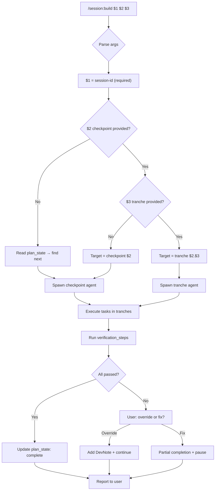

# Build Mode for session

> **Session**: `2025-12-28_build-mode_f8k2n5`
> **Status**: ✅ Finalized
> **Created**: 2025-12-28
> **Finalized**: 2025-12-28

---
**SPEC FINALIZED** - This specification is locked. Proceed to plan phase.

---

## Overview

Defining how build mode should work in the session skill. Build mode is the final phase of the spec → plan → build workflow, where we execute the planned checkpoints to transform the codebase from its current state to the desired state defined in the spec.

The existing `build/OVERVIEW.md` provides a high-level outline, but we need to fully specify:
- The interaction model (how autonomous vs. interactive)
- Task execution mechanics
- Verification and validation approach
- Error handling and recovery
- State management for resumability
- The actual skill prompt that drives build mode

## Problem Statement

Build mode needs to execute a finalized plan in a way that:
1. Keeps the user in the loop during this validation/iteration phase
2. Maintains clean context by spawning separate agent tasks per checkpoint
3. Tracks progress persistently so sessions can pause/resume
4. Captures implementation learnings (DevNotes) when reality diverges from plan

## Goals

### High-Level Goals

- Execute finalized plans reliably with clear progress tracking
- Enable pause/resume at any point without losing context
- Capture learnings and deviations as implementation unfolds

### Mid-Level Goals

- **Checkpoint-as-Agent**: Each checkpoint spawns a dedicated agent task with clean context
- **Progress Persistence**: Update plan state after each task/checkpoint completion
- **DevNotes**: Document implementation learnings, deviations, and decisions during build
- **User-in-Loop**: Present results after each checkpoint for validation (current phase)

### Detailed Goals

**DevNotes System**
- Separate JSON file (`dev-notes.json`) in session directory
- Each note has: id, timestamp, scope (task/checkpoint/session ref), category, content
- Accumulates knowledge throughout implementation process
- Categories: deviation, discovery, decision, blocker, resolution
- Machine-parseable for potential future tooling/analysis

**Flexible Execution Granularity**
- Auto-discovery: Build command reads plan state, determines next work item
- Configurable targeting: Can specify checkpoint or tranche explicitly
- Nested agent option: Checkpoint agent could spawn tranche sub-agents
- Default: Checkpoint-level agents (tranche-level can be added later)

**Error Handling: Partial Completion**
- Errors treated like a pause - track exact position (checkpoint, tranche, task)
- Update plan_state with current progress before stopping
- Add DevNote capturing what went wrong
- Resume picks up exactly where we left off

**Verification: Required with Override**
- Default: All verification_steps must pass before checkpoint marked complete
- User can override/skip specific checks when intentional changes occur
- Override requires explicit confirmation and creates DevNote documenting why
- Goal: Guarantee correctness, but flexibility when reality diverges from plan

**Command Syntax**
```
/session:build [session-id] [checkpoint] [tranche]

Arguments:
  $1 = session-id   (required - the session to build)
  $2 = checkpoint   (optional - specific checkpoint number, e.g., "2")
  $3 = tranche      (optional - specific tranche id, e.g., "2.1")

Examples:
  /session:build 2025-12-28_build-mode_f8k2n5
    → Auto-discover next incomplete checkpoint

  /session:build 2025-12-28_build-mode_f8k2n5 2
    → Execute checkpoint 2 specifically

  /session:build 2025-12-28_build-mode_f8k2n5 2 2.1
    → Execute only tranche 2.1 within checkpoint 2

Frontmatter:
  argument-hint: [session-id] [checkpoint] [tranche]
```

## Non-Goals

*What we are explicitly NOT building - prevents scope creep*

-

## Success Criteria

*How do we know we're done? Testable outcomes*

- [ ]

## Context & Background

### Existing Components

The session skill already has:
- **Spec phase**: Question-driven exploration to define WHAT to build
- **Plan phase**: Checkpoint-based planning with IDK task definitions
- **build/OVERVIEW.md**: High-level description of build execution

### Related Files

- `.claude/skills/session/SKILL.md` - Main skill documentation
- `.claude/skills/session/build/OVERVIEW.md` - Current build overview
- `.claude/skills/session/plan/OVERVIEW.md` - Plan phase reference
- `agents/sessions/{session-id}/plan.json` - Source of truth for build execution

## Key Decisions

| Decision | Rationale | Date |
|----------|-----------|------|
| User-in-loop after each checkpoint | Validate process before automating further | 2025-12-28 |
| Spawn new agent task per checkpoint | Clean context window, self-contained execution | 2025-12-28 |
| Add DevNotes during implementation | Capture deviations and learnings from plan | 2025-12-28 |
| DevNotes as separate file with plan references | Notes can span task/checkpoint/session scope; keeps plan.json clean | 2025-12-28 |
| DevNotes in JSON format | Machine-parseable, structured for tooling/analysis | 2025-12-28 |
| Flexible execution granularity | Auto-discover or target checkpoint/tranche explicitly | 2025-12-28 |
| Default to checkpoint-level agents | Simpler initial implementation; tranche-level can be added later | 2025-12-28 |
| Partial completion on errors | Treat errors like pause; track position exactly; resume from there | 2025-12-28 |
| Verification required with user override | Tests must pass by default; user can skip with confirmation + DevNote | 2025-12-28 |
| Positional arguments: session-id, checkpoint, tranche | Follows Claude Code slash command conventions with $1, $2, $3 | 2025-12-28 |

## Open Questions

- [x] ~~What level of user interaction is desired during build?~~ → User-in-loop after each checkpoint
- [x] ~~Where should DevNotes live?~~ → Separate file with references to plan elements
- [x] ~~What format should DevNotes use?~~ → JSON (structured, machine-parseable)
- [x] ~~What information does a checkpoint agent need in its prompt?~~ → Checkpoint data + spec goals + prior DevNotes + plan_state
- [x] ~~What's the default execution granularity?~~ → Checkpoint-level (simpler initial implementation)
- [x] ~~How should errors and blockers be handled?~~ → Partial completion; treat as pause; track exact position
- [x] ~~How should verification between checkpoints work?~~ → Required by default; user can override with confirmation + DevNote
- [x] ~~What's the command syntax for `/session:build`?~~ → Positional args: $1=session-id, $2=checkpoint, $3=tranche

## Diagrams

### Execution Granularity Options

```
Option A: Checkpoint-level agents
┌─────────────────────────────────────────────────────────┐
│  Build Coordinator (main conversation)                  │
│                                                         │
│  /session:build → auto-discover next checkpoint         │
│  /session:build checkpoint 2 → target specific          │
│                                                         │
│    ┌─────────────────┐  ┌─────────────────┐             │
│    │ Checkpoint 1    │  │ Checkpoint 2    │  ...        │
│    │ Agent           │  │ Agent           │             │
│    │ (all tranches)  │  │ (all tranches)  │             │
│    └─────────────────┘  └─────────────────┘             │
└─────────────────────────────────────────────────────────┘

Option B: Tranche-level agents (more granular)
┌─────────────────────────────────────────────────────────┐
│  Build Coordinator                                      │
│                                                         │
│  /session:build tranche 2.1 → target specific tranche   │
│                                                         │
│    ┌─────────────────────────────────────────┐          │
│    │ Checkpoint 1 Agent                      │          │
│    │   ├── Tranche 1.1 Sub-agent            │          │
│    │   └── Tranche 1.2 Sub-agent            │          │
│    └─────────────────────────────────────────┘          │
└─────────────────────────────────────────────────────────┘
```

### Build Flow



## Notes

*Working notes, ideas, considerations*

- Initial implementation focuses on checkpoint-level execution
- Tranche-level granularity can be added in future iteration
- DevNotes system is new addition to session skill
