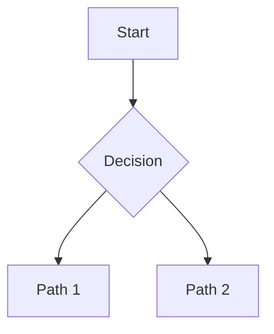

# Session Database Tracking Necessity

> **Session**: `2026-02-16_session-database-tracking-necessity_j3ehqn`
> **Status**: ✅ Finalized - Ready for Plan
> **Created**: 2026-02-16
> **Finalized**: 2026-02-16

## Overview

Exploring whether sessions need to be tracked in the database at all. The recent session `2026-02-14_claude-code-agent-sdk-integration` established that the filesystem is the source of truth for session state. This raises the question: if the filesystem is authoritative and portable, what value does the database actually provide?

## Problem Statement

We just built a sync layer (StateManager + MCP tools + sync.py) to keep the database mirrored from the filesystem. But if the filesystem is the source of truth and we never write back to it from the database, **what value does the database session tracking actually provide?**

The sync layer adds complexity. If it's just a cache, is that complexity justified?

### The Core Tension

```
┌─────────────────────────────────────────────────────────────────────────────┐
│                                                                             │
│  WHAT WE BUILT                           WHAT WE'RE QUESTIONING             │
│  ──────────────                          ─────────────────────              │
│                                                                             │
│  StateManager + MCP Tools                Database Session Table             │
│  → Programmatic phase control            → Mirror of state.json             │
│  → Agent handoffs between phases         → Never written to directly        │
│  → THIS IS VALUABLE ✓                    → Just a cache layer?              │
│                                                                             │
│  Filesystem (state.json)                 Sync Layer                         │
│  → Source of truth                       → Complexity to maintain           │
│  → Portable (moves with code)            → One-way only                     │
│  → THIS IS VALUABLE ✓                    → Is this necessary?               │
│                                                                             │
└─────────────────────────────────────────────────────────────────────────────┘
```

### User's Mental Model

**Portability is paramount**: You should be able to pick up this codebase and drop it anywhere. The Orchestrator UI should operate somewhat independently - it doesn't own the sessions, it just observes them.

**Database for execution tracking**: Agent logs, costs, tokens - ephemeral execution data that doesn't need to be portable.

**Open question**: If sessions aren't in the database, how do we link agent_logs to sessions?

## Goals

### High-Level Goals

1. **Confirm architectural direction** - Validate that database session tracking is necessary and worth the sync complexity
2. **Define clear sync strategy** - Establish when and how filesystem→DB sync happens
3. **Keep concerns separated** - StateManager shouldn't know about databases; sync is infrastructure

### Mid-Level Goals

1. **Enable rich queries** - Database should support queries like "sessions in build phase" or "total cost per project"
2. **Non-blocking sync** - Agent operations shouldn't wait for DB updates
3. **Eventual consistency is OK** - UI may be briefly stale, that's acceptable

### Detailed Goals

1. StateManager gains an optional `on_save_callback` for sync notification
2. Backend infrastructure injects callback that queues async sync task
3. Sync task pool runs independently, doesn't block agent execution
4. Project open in UI triggers batch sync for all sessions in that project
5. Split `session_db/models.py` (855 lines) into domain-organized modules

## Non-Goals

*What we are explicitly NOT building - prevents scope creep*

-

## Success Criteria

*How do we know we're done? Testable outcomes*

- [ ]

## Context & Background

*Relevant existing systems, prior art, stakeholder input. Include user's mental model and design philosophy when relevant.*

### Prior Work

The `2026-02-14_claude-code-agent-sdk-integration` session established:
- **Filesystem is source of truth** - sessions are portable, database is reconstructable
- **Database is query layer + execution tracking** - agents/agent_logs tables
- **Sync is one-way** - filesystem → database (no bidirectional sync needed)

This architecture was implemented with:
- StateManager for filesystem state.json updates
- MCP tools for agent state transitions
- Sync functions for filesystem → database onboarding

## Key Decisions

### Keep full session mirror in database
**Rationale**: Query flexibility is worth the sync complexity. Being able to query "sessions in build phase" or "sessions with >3 checkpoints" from the database enables richer analysis and UI capabilities.
**Made**: 2026-02-16

### Sync strategy: On-open + post-MCP (async, non-blocking)
**Rationale**:
- **On project open**: Sync all sessions for that project (batch catch-up)
- **After each MCP tool call**: Sync that specific session (incremental updates)
- **Async/fire-and-forget**: Use a background task pool, don't block the main event loop or agent execution

This keeps the DB reasonably fresh without adding latency to agent operations.
**Made**: 2026-02-16

### Sync trigger: Event from StateManager.save()
**Rationale**:
- StateManager.save() triggers a background sync (e.g., in a finally block)
- Only needs to pass the session directory path to the background task
- Background task reads state.json and syncs to DB independently
- StateManager stays decoupled from database concerns - it just signals "I saved"

```python
# Conceptual pattern
class SessionStateManager:
    def __init__(self, session_dir, on_save_callback=None):
        self.on_save_callback = on_save_callback  # Injected by caller

    def save(self):
        try:
            # ... write state.json ...
        finally:
            if self.on_save_callback:
                self.on_save_callback(self.session_dir)  # Fire and forget
```

The backend that creates StateManager instances injects the callback that queues the background sync.
**Made**: 2026-02-16

### Split models.py into domain modules
**Rationale**: Current `session_db/models.py` is 855 lines - too large for maintainability. Split by domain for better organization.

```
session_db/
├── models/
│   ├── __init__.py      # Re-exports all models for backward compat
│   ├── base.py          # Type aliases, shared types
│   ├── project.py       # Project, ProjectCreate, ProjectUpdate, ProjectSummary
│   ├── session.py       # Session, SessionCreate, SessionUpdate, SessionSummary
│   ├── agent.py         # Agent, AgentCreate, AgentUpdate, AgentSummary
│   └── agent_log.py     # AgentLog, AgentLogCreate, AgentLogSummary
├── crud.py
├── sync.py
└── ...
```

**Made**: 2026-02-16

## Open Questions

- [x] What UI capabilities require database-backed session tracking? → **Joins for analysis** (e.g., "show failed agents for sessions in build phase")
- [x] Can those capabilities be served by filesystem scanning instead? → No, queries need structured data
- [x] What's the cost of maintaining the sync layer vs. not having it? → Worth it for query flexibility
- [x] Are there cross-project queries that justify database storage? → Yes (aggregations, filtering)
- [x] **How much of the session needs to be in the DB?** → Full mirror for query flexibility
- [x] What happens if background sync fails? → Log and move on (filesystem is source of truth, next sync will catch up)

## Diagrams

*Mermaid or ASCII diagrams as understanding develops*



## Notes

*Working notes, ideas, considerations*

---
*This spec is a living document until finalized.*
