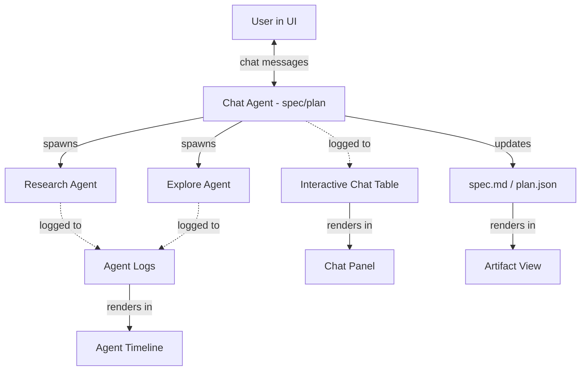

# Connect Spec/Plan/Build Flow to Frontend Sessions

> **Session**: `2026-02-19_connect-spec-plan-build-to-frontend-sess_enr0i6`
> **Status**: Finalized
> **Created**: 2026-02-19
> **Finalized**: 2026-02-19

## Overview

Connect the existing spec/plan/build workflow (currently CLI-only via Claude Code skills) to the frontend UI, enabling users to initiate sessions, interact via a chat panel during spec interviews, and track phase progression visually. The backend orchestrator with three-stream pattern (reference impl) provides the streaming foundation for real-time agent communication.

**Current state**: The session system works entirely through Claude Code CLI skills. The frontend can *display* sessions (swimlane, phase tabs, agent timelines) but cannot *drive* them. No chat UI exists. No real-time streaming — only polling-based sync from filesystem.

**Desired state**: Users interact with the spec/plan/build workflow through the frontend — starting sessions, chatting during spec interviews, viewing live agent progress, and tracking the full lifecycle visually.

## Problem Statement

The spec/plan/build workflow currently lives entirely inside Claude Code CLI. Users can't drive sessions from the frontend — they can only view results after the fact via filesystem sync. This means the powerful interview-driven spec process, interactive planning, and build oversight are all locked behind the terminal.

We need to bring this workflow into the UI so users can have a natural back-and-forth conversation with session agents, see artifacts (spec.md, plan.json) update in real-time as the conversation progresses, and manage the full lifecycle visually.

## Goals

### High-Level Goals

- Enable users to drive the spec interview workflow from the frontend UI via an interactive chat panel, establishing the UX groundwork for the full spec/plan/build lifecycle. This matters because the spec phase is the entry point for all sessions — getting this right sets the pattern for every subsequent phase.

### Mid-Level Goals

1. **Backend spec agent service** — `ClaudeSDKClient`-based service that loads session skills from filesystem, manages agent lifecycle (create/resume/disconnect), fires hooks for AgentLog observability, and routes messages between frontend and SDK.
2. **Interactive chat data layer** — New `interactive_messages` table with block-level granularity, separate from AgentLog. Serves as the rendering source for the chat panel. Supports querying by session/phase for efficient display.
3. **Frontend three-column layout with chat panel** — Session detail page with sidebar | artifact tabs | chat panel. Chat renders blocks as they arrive. Artifact view polls for changes with content hashing. AskUserQuestion renders as structured select/multi-select UI.
4. **End-to-end session flow** — "New Session" button → spec interview starts immediately → agent asks questions, user responds → spec.md updates live → "Continue to Plan" button when spec finalizes.

### Detailed Goals

- **Session creation**: "New Session" button creates session directory + state.json, spins up ClaudeSDKClient, sends initial `/session:spec` prompt, agent's first question streams into chat panel
- **Message flow**: User types → backend `client.query()` → `receive_response()` yields blocks → blocks written to interactive_messages table + streamed to frontend → chat panel renders incrementally
- **Artifact polling**: Frontend periodically fetches spec.md content, compares hash, re-renders SpecView only on change
- **Session resume**: User leaves and returns → frontend loads chat history from interactive_messages → backend creates new client with `resume=sdk_session_id` → conversation continues seamlessly
- **AskUserQuestion**: ToolUseBlock for AskUserQuestion detected → renders as structured UI (select/multi-select/other) → user selection formatted as tool result → sent back to SDK
- **AgentLog integration**: PreToolUse/PostToolUse hooks write to AgentLog table for all agent activity (including background agents)
- **Phase transition**: Spec finalizes → "Continue to Plan" button appears (in chat panel or artifact area) → clicking updates state.json, disconnects spec client → plan phase ready (plan UX deferred)
- **Block-level chat rendering**: TextBlocks as chat bubbles, ToolUseBlock/ToolResultBlock as collapsible activity indicators, ThinkingBlocks hidden or collapsed

## Non-Goals

- **Build phase UI integration** — out of scope. Learnings from spec phase UX will inform build.
- **Docs phase UI integration** — out of scope.
- **Plan phase deep design** — deferred. Get spec phase working first, then design plan UX.
- **Per-token streaming** — block-level streaming is sufficient for now.
- **Replacing the CLI workflow** — CLI continues to work as-is. UI is an additional interface, not a replacement.

## Success Criteria

- [ ] User can click "New Session" and immediately begin a spec interview conversation in the chat panel
- [ ] Agent asks questions, user responds, spec.md updates and re-renders in the artifact view
- [ ] Chat history persists — user can leave and return to an in-progress spec session
- [ ] AskUserQuestion renders as structured select UI in the chat panel
- [ ] All agent tool activity is captured in AgentLog for observability
- [ ] "Continue to Plan" button appears when spec is finalized
- [ ] Existing CLI workflow continues to work unaffected

## Context & Background

### Existing Architecture

**Frontend** (Next.js 16 + React 19):
- Swimlane view for session progress visualization
- Phase tabs (SPEC/PLAN/BUILD/DOCS) on session detail pages
- SpecView renders spec.md markdown, PlanView shows plan.json
- BuildView displays agents + metrics, DocsView for docs phase
- Zustand stores for projects and sessions state
- API routes that query PostgreSQL via Drizzle ORM
- session-sync.ts syncs filesystem state.json → database
- **No chat/messaging UI components exist**
- **No real-time streaming — polling only**

**Backend** (FastAPI + SQLModel):
- StateManager manages state.json with validated phase transitions
- MCP tools let agents modify session state (7 tools: transition_phase, init_build, etc.)
- Fire-and-forget async DB sync via SyncTaskPool (5 concurrent)
- Agent model tracks SDK session IDs for resumption
- AgentLog captures hooks, responses, and phase events
- Claude Agent SDK integration for multi-turn agent execution

**Reference: orchestrator_3_stream**:
- Three-stream pattern: pre-execution log → stream via WebSocket → post-execution log
- WebSocket manager for broadcasting events to connected clients
- Hook callbacks (pre/post tool use) for real-time streaming
- Demonstrates full agent-to-UI streaming pipeline

**Session Skill System** (CLI-only today):
- Spec: Interview-driven, saves after every exchange, captures user's mental model
- Plan: Checkpoint-based with task groups/tasks/actions, vertical slice architecture
- Build: Interactive or autonomous execution, dev-notes capture
- Docs: Agent-determined documentation updates
- State tracking via state.json with MCP tools

## Key Decisions

### Chat-based interaction model for spec interviews
**Rationale**: The spec phase is fundamentally conversational — an interview loop where the agent asks questions and the user responds in natural language. This maps naturally to a chat UI rather than structured forms. The user envisions it working "very similar to how the orchestrator agent works with ADWs" — a session chat channel that takes messages back and forth with the top-level session agents. The agent updates artifacts (spec.md) as the conversation progresses, and those changes render live in the UI.
**Made**: 2026-02-19

### Agent SDK `ClaudeSDKClient` as the execution engine
**Rationale**: The SDK provides two interfaces: `query()` for one-off tasks and `ClaudeSDKClient` for continuous conversations. The spec/plan chat is a textbook `ClaudeSDKClient` use case — it maintains session continuity across multiple exchanges, supports hooks (for AgentLog streaming), custom tools, and interrupts. The backend creates a `ClaudeSDKClient` instance configured with:
- `setting_sources=["project"]` — loads skills from `.claude/skills/`, including the session skill
- `allowed_tools=["Skill", "Read", "Write", "Edit", "Bash", ...]` — enables the Skill tool so the agent can invoke session skills
- `mcp_servers` — session state MCP tools for phase transitions, checkpoint tracking
- `hooks` — PreToolUse/PostToolUse hooks that write to AgentLog for observability
- `cwd` — project working directory

The initial prompt could be a slash command (e.g., `/session:spec topic-name`) which the SDK automatically discovers from `.claude/commands/`. Subsequent messages use `client.query()` to continue the conversation with full context.

The SDK's `receive_response()` yields `AssistantMessage`, `ToolUseBlock`, `ToolResultBlock`, and `ResultMessage` — these are the blocks that get streamed back to the frontend chat panel.
**Made**: 2026-02-19

### Two distinct data channels: Interactive Chat vs Agent Logs
**Rationale**: The user sees two fundamentally different interaction modes across phases:
- **Interactive phases (spec, plan)**: User is in the loop, having a back-and-forth conversation. This conversation needs to be persisted and replayable — "essentially replicate what we're doing here now, where we're talking about it updating the spec." This is a **new table** — not AgentLog, not orchestrator chat, but something like "interactive chat" or "session messages."
- **Autonomous phases (build, docs)**: Agent runs on its own, user monitors. AgentLog captures the detailed execution events (tool calls, hooks, responses). User isn't chatting — they're watching progress.
- **AgentLog stays** for all phases — it tracks background agents, detailed tool call events, and execution observability. The interactive chat is a separate, higher-level conversation thread.
**Made**: 2026-02-19

### New ClaudeSDKClient per phase (not long-lived)
**Rationale**: Each phase gets a fresh `ClaudeSDKClient`. This mirrors the current CLI workflow where each phase is a separate Claude Code conversation. Benefits:
- Fresh context window — agent only needs to look at what it's trying to do and the artifacts collected so far
- No context bloat from earlier phases
- Clean separation — spec agent, plan agent, build agent are distinct instances
- Each phase's agent reads the relevant artifacts (spec.md, plan.json, state.json) as input, not conversation history from prior phases

When the spec phase finalizes, the backend disconnects the spec client and creates a new client for the plan phase. The plan agent reads the finalized spec.md and proceeds. Same pattern for plan → build.

The interactive chat table tracks `phase` per message, so the chat panel can show the conversation history per-phase or across the whole session.

**Resumption**: Within a phase, if the user leaves and comes back (or the backend restarts), the conversation is resumed via the SDK's `resume` parameter using the stored `sdk_session_id` from the Agent model. The SDK automatically loads the full conversation history and context. The user picks up exactly where they left off. The interactive chat table provides the rendering history for the UI while the SDK manages the actual conversation state.
**Made**: 2026-02-19

### Phase-dependent interaction modes
**Rationale**: Not all phases need the same level of user involvement:
- **Spec**: Highly interactive — interview-style chat, every response matters
- **Plan**: Interactive — discussing approach, confirming checkpoints
- **Build**: Mostly autonomous — "just let it run," user monitors via agent timeline
- **Docs**: Autonomous — agent determines what needs updating
The chat UI surfaces during interactive phases; the monitoring/timeline UI surfaces during autonomous phases.
**Made**: 2026-02-19

## Open Questions

- [x] What is the primary interaction model for spec interviews in the UI? → **Chat-based back-and-forth**
- [x] How should messages be persisted? → **New interactive chat table, block-level granularity, separate from AgentLog**
- [x] What level of real-time feedback differs by phase? → **Chat for spec/plan, monitoring for build/docs**
- [x] Layout? → **Three-column: sidebar | artifact tabs | chat panel**
- [x] Chat table granularity? → **Per-block rows (not per-turn). Double-stored alongside AgentLog — chat table is the rendering source for the interactive panel.**
- [ ] Should the CLI workflow remain fully functional alongside the UI?
- [x] How does the user initiate a new session? → **"New Session" button → enters chat, agent starts spec interview immediately**
- [ ] How does the chat panel transition when moving between phases (spec → plan)?
- [x] Phase transition UX? → **Two paths: user clicks "Continue to Plan" button, OR agent asks if ready and user confirms in chat. Both update state and spin up plan phase. Plan phase details deferred — focus is spec phase UX first.**
- [ ] ~~What should the chat panel show during autonomous phases (build/docs)?~~ → **Deferred — out of scope for this iteration**
- [x] How does AskUserQuestion render in chat UI? → **Structured UI: select/multi-select with options, "Other" for free text. Response format matches SDK tool output schema.**

## Diagrams

### Session Creation Flow

User hits "New Session" → navigates to session detail page with three-column layout → chat panel is active and the spec agent starts the interview immediately. Minimal friction — no separate topic form or configuration dialog. The agent's first message is the opening question (like "What are we building?"), and the topic/session_id gets derived from the initial exchange.

Behind the scenes:
1. Frontend calls backend API to create a new session (creates filesystem directory + state.json)
2. Backend spins up a `ClaudeSDKClient` with the session skill loaded
3. Sends the initial `/session:spec` prompt (or equivalent)
4. Agent's first response streams into the chat panel — the interview begins
5. Session appears in the sidebar immediately

### UI Layout — Three-Column Design

The session detail page uses a three-column layout:

```
┌──────────┬────────────────────────────┬──────────────────┐
│          │                            │                  │
│ Sessions │   Artifact Tabs            │   Chat Panel     │
│ Sidebar  │   (SPEC/PLAN/BUILD/DOCS)   │   (right side)   │
│          │                            │                  │
│ (left)   │   ← Primary focus →        │   ← Secondary →  │
│          │                            │                  │
│          │   spec.md rendering        │   Conversation   │
│          │   plan.json view           │   with agent     │
│          │   build agents/metrics     │                  │
│          │   docs updates             │                  │
│          │                            │                  │
└──────────┴────────────────────────────┴──────────────────┘
```

- **Left**: Session sidebar (existing) — navigation between sessions
- **Center**: Artifact tabs (existing, enhanced) — the primary content. Spec rendering, plan view, build progress, doc updates. This is the "main thing."
- **Right**: Chat panel (new) — the conversation with the session agent. Secondary to the artifacts — the chat drives the work, but the artifacts are what you're looking at.

All three panels are always visible (no collapsing for now). The artifacts are the center of gravity; the chat is how you influence them.

### Agent Hierarchy & Tracking Model

The system has two distinct concerns:

1. **Interactive Chat** (new table) — The primary conversation thread between the user and the top-level session agent (spec agent, plan agent). This is what the user sees in real-time, what gets streamed to the UI, and what drives the workflow forward.

2. **Agent Logs** (existing) — Every single agent instance that gets spun up is tracked. Whether it's a research agent, an explore agent, a build agent, or any sub-agent — every invocation gets logged with full tool call detail. These are linked back to the parent session. This is the comprehensive execution record.

The chat agent is the "main thread" the user interacts with. Background agents (research, explore, build workers) are tracked via AgentLog but don't pollute the chat conversation. They can be viewed in the agent timeline on the session detail page.



### Data Flow — Message Lifecycle

```
User types message → Frontend sends to Backend API
                          ↓
                    Backend's ClaudeSDKClient.query(message)
                    (first message: connect() + query(); subsequent: query() on existing client)
                          ↓
                    Agent processes via Skills + MCP tools
                    (Skill tool loads session skill → agent follows spec interview logic)
                    (MCP tools update state.json with validated transitions)
                    (Read/Write/Edit tools update spec.md, plan.json)
                          ↓
                    Hooks fire on PreToolUse/PostToolUse
                    → Write to AgentLog table (background agents, tool observability)
                          ↓
                    receive_response() yields message blocks
                    → Backend streams to frontend (delivery mechanism TBD)
                    → Backend writes to interactive chat table
                          ↓
                    Frontend updates chat panel with streamed blocks
                          ↓
                    Frontend polls artifact file for changes
                    (hash/content comparison — only re-renders if changed)
```

**Key details**:
- **ClaudeSDKClient lifecycle**: Backend maintains a `ClaudeSDKClient` instance per active session conversation. First message triggers `connect()` + `query()`. Subsequent messages call `query()` on the same client, preserving full conversation context. The SDK's internal session ID maps to our Agent model's `sdk_session_id`.
- **Skill-driven behavior**: The agent doesn't need a custom system prompt replicating SKILL.md logic. By loading `setting_sources=["project"]` and allowing the `Skill` tool, the SDK automatically discovers and loads the session skill from `.claude/skills/session/`. The agent behaves exactly as it does in CLI — same interview questions, same atomic saves, same finalization flow.
- **Response streaming**: Not per-token streaming. `receive_response()` yields complete message blocks (`AssistantMessage` with `TextBlock`, `ToolUseBlock`, etc.) as they arrive. `include_partial_messages=True` could be used for `StreamEvent` if finer granularity is needed later.
- **Artifact refresh**: Polling-based, not event-driven. The frontend periodically checks if the artifact file (spec.md, plan.json) has changed — possibly via content hash comparison. Only re-renders if the content actually changed. Cached version stays until a change is detected.
- **Decoupled updates**: Chat panel and artifact panel update independently. Chat shows the conversation in real-time; artifact view catches up via polling. No tight coupling between them.

### Interactive Chat Table — Schema Direction

The interactive chat table stores **individual blocks** as they arrive, not whole turns. This means:

- Each `TextBlock`, `ToolUseBlock`, `ToolResultBlock` from the agent gets its own row
- User messages also get their own row (one per submission)
- Blocks are ordered by timestamp for rendering the conversation chronologically
- This data is "double-stored" alongside AgentLog — AgentLog has the same content but serves a different purpose (execution observability vs. chat rendering)

**Why separate from AgentLog**: The chat table is specifically for rendering the interactive conversation panel. It needs to be fast to query per-session, ordered for display, and filtered to only the "chat agent" (not background agents). AgentLog is a broader firehose of all agent activity. Different query patterns, different rendering needs.

### AskUserQuestion — Structured Rendering in Chat

When the agent calls `AskUserQuestion`, it arrives as a `ToolUseBlock` in the message stream. The chat panel detects this specific tool and renders it as structured UI:

- **Single select**: Radio buttons / selectable chips for each option
- **Multi-select**: Checkboxes / toggle chips
- **"Other" option**: Always available as a free-text input field
- **Header**: Displayed as a label above the question

When the user selects their answer(s), the frontend formats the response as the tool output:
```json
{"answers": {"question text": "selected option label"}}
// Multi-select: {"answers": {"question text": "Option A, Option B"}}
```

This gets sent back through the backend to the SDK as the tool result, and the agent continues.

**Open question**: The exact mechanism for intercepting the `AskUserQuestion` tool call and deferring it until the user responds needs investigation. Options include:
- `can_use_tool` callback that pauses execution until frontend responds
- `permission_prompt_tool_name` redirecting to a custom MCP tool
- Hooks that intercept the PreToolUse event

The response format is well-defined by the SDK — it's just a matter of routing the user's selection back through the backend to the SDK's tool execution pipeline.

**Tentative schema direction**:
```
interactive_messages
├── id (UUID)
├── session_id (FK → sessions)
├── agent_id (FK → agents)
├── phase (spec | plan)
├── role (user | assistant | tool_use | tool_result)
├── block_type (text | tool_use | tool_result | thinking)
├── content (text content or JSON for tool blocks)
├── tool_name (nullable — for tool_use/tool_result blocks)
├── turn_index (groups blocks into turns for rendering)
├── block_index (order within a turn)
├── timestamp
```

The chat panel renders by querying `interactive_messages WHERE session_id = X ORDER BY turn_index, block_index`. The panel can choose what to show — e.g., render `text` blocks as chat bubbles, collapse `tool_use`/`tool_result` into activity indicators, hide `thinking` blocks.

## Notes

*Working notes, ideas, considerations*

---
*This spec is a living document until finalized.*
